# Game Design Document

## Mabel the Engineer

**Genre:** Educational Adventure / Puzzle  
**Platform:** PC (Godot 4.5 / C# .NET 8)  
**Target Audience:** Ages 8–12  
**Version:** 0.1 (draft)

---

## 1. Vision

Mabel the Engineer is a story-driven educational game in which a young girl discovers that understanding the world — through math, reading, and logical thinking — is a power anyone can learn. Where the world around her relies on magic as a black box, Mabel builds her own solutions from first principles.

**Core thesis:** Understanding is not a gift. It is a skill.

**Design principle:** Every challenge the player faces is one Mabel faces too. The game never breaks frame to present an abstract exercise. Math problems arise from broken machines. Logic puzzles arise from obstacles in the world. Reading challenges arise from letters, signage, and overheard conversations. The fiction and the curriculum are the same thing.

**Primary skills trained:**

- Reading comprehension (R1–R3)
- Mathematical reasoning (M1–M4)
- Logical / systemic thinking (L1–L3)

---

## 2. Narrative

### 2.1 Overview

Mabel lives in Beaverford, a village that outsources all problem-solving to magic and the wizard who maintains it. When Mabel fails the Wizard School entrance test — she has no magical ability whatsoever — she is turned away. Back home, she discovers she can fix things without magic: with math and physical reasoning. The village calls it "invisible magic." A wizard passing through exposes her as a fraud.

A secret letter arrives. The Guild of Engineers recruits her. Under their tutelage she works in secret, fixing the village at night while the Wizard is increasingly absent. But the magical infrastructure is failing. Following the darkness to its source, Mabel finds the mana spring has been mined almost dry — by the Wizard himself, who secretly founded and controls the Guild. He has kept the village dependent on him twice over: through magic, and through a guild that answers only to him.

The Wizard leaves alone to find a new mana source. Mabel returns to the village and replaces its magical systems with machines anyone can operate. She becomes a teacher.

### 2.2 Themes

- **Dependency vs. understanding** — magic as metaphor for systems that work but cannot be questioned
- **Gatekeeping vs. empowerment** — who decides who is allowed to learn
- **Institutional control** — the Wizard's control was never about magic; it was about remaining necessary
- **Engineering as democratization** — knowledge shared is power redistributed

### 2.3 Acts

| Act | Title                       | Hook                                  |
| --- | --------------------------- | ------------------------------------- |
| I   | Welcome to Beaverford       | Mabel fails Wizard School             |
| II  | Spellcasting Without a Wand | She fixes things anyway; is exposed   |
| III | The Guild of Engineers      | Secret training; magic begins failing |
| IV  | The Secret of the Wizards   | Blackout reveals the Wizard's mine    |
| V   | Everyone Can Do Magic       | Village rebuilds with engineering     |

---

## 3. Chapter Breakdown

### Act I — Welcome to Beaverford

| Chapter | Title                    | Summary                                                                                                                                                                                                              |
| ------- | ------------------------ | -------------------------------------------------------------------------------------------------------------------------------------------------------------------------------------------------------------------- |
| I.1     | Morning in Beaverford    | Mabel wakes and explores the village. Player introduced to the "Backlog of Broken Things" and the Wizard's unreliability. Narrative chapter.                                                                         |
| I.2     | The Ambition             | Mabel tries to help neighbors but is rejected. She applies to Wizard School. First math challenge: simple M1 problem framed as measuring or counting something in the village.                                       |
| I.3     | The Wizard School Trials | Mabel visits elemental wizards. L1 world puzzles to access each wizard. Spark Tests that she fails — the logic puzzle is solved; the magic test is not. The player succeeds at the puzzle and still fails the trial. |
| I.4     | The Heavy Heart          | Mabel walks home through the forest, passing the guarded Mana Spring. Narrative chapter.                                                                                                                             |

### Act II — Spellcasting Without a Wand

| Chapter | Title                 | Summary                                                                                                                                                |
| ------- | --------------------- | ------------------------------------------------------------------------------------------------------------------------------------------------------ |
| II.1    | The Desperate Help    | A villager needs help with something urgent that magic cannot solve. Mabel intervenes with a math-based fix. M1 challenge framed as the repair itself. |
| II.2    | The Rumor Mill        | The villager spreads the story. Cutscene / dialogue-heavy. Narrative chapter.                                                                          |
| II.3    | The Busy Week         | Mabel solves the Backlog. Multiple M2 challenges, each a different broken device or stuck situation.                                                   |
| II.4    | The Exposure          | A traveling wizard tests Mabel publicly and reveals she has no mana. Narrative chapter; introduces R2 background reading.                              |
| II.5    | The Mysterious Letter | A gear-sealed letter arrives. First dedicated Reading challenge (R2): player must decode the letter, a physical puzzle object rather than dialogue.    |

### Act III — The Guild of Engineers

| Chapter | Title                   | Summary                                                                                                                                                          |
| ------- | ----------------------- | ---------------------------------------------------------------------------------------------------------------------------------------------------------------- |
| III.1   | The Hidden Workshop     | Mabel finds the secret entrance (L1 logic puzzle). First exposure to engineering tools and the Guild mentors.                                                    |
| III.2   | The Night Shift         | Night-time sequences fixing the town. M3 math challenges — multi-step problems arising from machine calibration and repair.                                      |
| III.3   | The Ghost of Beaverford | Villagers try to work out who is fixing things. First R3 challenge: player must piece together meaning from multiple dialogue fragments and environmental clues. |
| III.4   | The Flickering World    | Magic is failing. Mabel investigates. L2 logic puzzle — multi-step world puzzle with intermediate states, framed as diagnosing a failing system.                 |

### Act IV — The Secret of the Wizards

| Chapter | Title                  | Summary                                                                                                                                 |
| ------- | ---------------------- | --------------------------------------------------------------------------------------------------------------------------------------- |
| IV.1    | The Great Blackout     | Total magical failure. Mabel builds her first Mechanical Lantern. M3 challenge embedded in the construction.                            |
| IV.2    | The Unguarded Forest   | Navigation through dark woods. L2 logic puzzle using the lantern. No guards — the spring's entrance is open for the first time.         |
| IV.3    | The Mana Mine          | Mabel discovers the clearing. R3 reading challenge: interpreting documents, maps, or logs in the mine to understand what has happened.  |
| IV.4    | Master of Gears Reveal | The Wizard is revealed as Guild leader. Narrative chapter.                                                                              |
| IV.5    | The Realization        | The Wizard asks for help finding a new vein. Mabel refuses and articulates the full truth. He leaves. Narrative chapter, R3 background. |

### Act V — Everyone Can Do Magic

| Chapter | Title                | Summary                                                                                                                                                            |
| ------- | -------------------- | ------------------------------------------------------------------------------------------------------------------------------------------------------------------ |
| V.1     | The Great Conversion | Mabel replaces the Mana Extractor with a Water Pump and Wind Turbine. M4 challenge: player must model the equation from a word problem — no values given directly. |
| V.2     | The Lesson           | Mabel teaches villagers to operate the machines. L3 systemic puzzle: multiple interacting machines, player must reason about the whole system. R2 background.      |
| V.3     | The Arcanum Shift    | The Wizard School is rebranded as an engineering school. Blueprints replace grimoires. Narrative chapter.                                                          |
| V.4     | Professor Mabel      | Final scene: Mabel at a chalkboard, teaching. Closing M4 challenge as a teaching moment — Mabel poses a problem to her students; the player solves it with her.    |

---

## 4. Core Mechanics

### 4.1 Exploration

Grid-based movement in a top-down world. Mabel moves tile-by-tile with smooth interpolation. The world is small and readable. Each area has interactive objects, NPCs with dialogue, and at least one challenge entry point per active chapter.

### 4.2 Math Challenges

Math challenges are embedded in the fiction — calibrating a machine, measuring materials, calculating weight. They appear as diegetic UI panels on the object being fixed, not as pop-up quiz screens.

Challenge types include direct input (typed answer), combination locks (digit selection), cogwheel alignment, and radar/pattern recognition. Each type maps to a visual metaphor consistent with the challenge content.

**Difficulty axis:** M1 (single operation, numbers given) → M4 (word problem, must construct the equation).

### 4.3 Reading Challenges

Reading challenges are delivered through in-world artifacts: letters, notice boards, machine logs, villager dialogue. The player never "takes a reading test." They read the letter. They read the sign. Understanding it is what moves the game forward.

**Difficulty axis:** R1 (short sentences, explicit information) → R3 (inferential, information spread across multiple sources).

### 4.4 Logic Puzzles

World puzzles requiring the player to manipulate objects in sequence to progress. Act I uses obvious single-action puzzles (push block, open door). By Act V, puzzles involve multiple interacting systems with emergent behavior.

**Difficulty axis:** L1 (single action, obvious goal) → L3 (systemic, must model interactions across multiple parts).

### 4.5 Quests

Quest objectives are given by NPCs or discovered in the world. Completing a chapter's challenge advances the active quest. Quest state (NOTSTARTED / INPROGRESS / COMPLETED / FAILED) is tracked and persisted across sessions.

### 4.6 Inventory

Mabel collects engineering tools and components as she progresses through the Guild. Inventory items unlock new interaction options in the world (a wrench unlocks bolted panels; a lantern unlocks dark areas). Items are not consumed — they expand what the player can do.

---

## 5. Skill Progression System

### 5.1 Skill Dimensions

| Skill       | Levels | Range                                     |
| ----------- | ------ | ----------------------------------------- |
| Reading (R) | 3      | R1 explicit → R3 inferential              |
| Math (M)    | 4      | M1 single-op → M4 model-from-word-problem |
| Logic (L)   | 3      | L1 single-step → L3 systemic              |

Each chapter has one **primary skill** (the challenge presented) and optional **background skills** (required to parse context, but not the challenge itself). Background skill levels are always kept low enough not to obstruct access to the primary challenge.

### 5.2 Chapter-Skill Matrix

| Chapter                       | Primary     | Level | Background |
| ----------------------------- | ----------- | ----- | ---------- |
| I.1 Morning in Beaverford     | — narrative | —     | R1         |
| I.2 The Ambition              | Math        | M1    | R1         |
| I.3 Wizard School Trials      | Logic       | L1    | R1, M1     |
| I.4 The Heavy Heart           | — narrative | —     | R1         |
| II.1 The Desperate Help       | Math        | M1    | R1         |
| II.2 The Rumor Mill           | — narrative | —     | R1         |
| II.3 The Busy Week            | Math        | M2    | R1         |
| II.4 The Exposure             | — narrative | —     | R2         |
| II.5 The Mysterious Letter    | Reading     | R2    | M1         |
| III.1 The Hidden Workshop     | Logic       | L1    | R2, M1     |
| III.2 The Night Shift         | Math        | M3    | R1         |
| III.3 The Ghost of Beaverford | Reading     | R3    | R2         |
| III.4 The Flickering World    | Logic       | L2    | R2, M2     |
| IV.1 The Great Blackout       | Math        | M3    | R1         |
| IV.2 The Unguarded Forest     | Logic       | L2    | R2         |
| IV.3 The Mana Mine            | Reading     | R3    | M1         |
| IV.4 Master of Gears Reveal   | — narrative | —     | R2         |
| IV.5 The Realization          | — narrative | —     | R3         |
| V.1 The Great Conversion      | Math        | M4    | R2         |
| V.2 The Lesson                | Logic       | L3    | R2, M2     |
| V.3 The Arcanum Shift         | — narrative | —     | R2         |
| V.4 Professor Mabel           | Math        | M4    | R2         |

### 5.3 Progression Notes

- **Act I** is the tutorial act. I.1 establishes reading/dialogue. I.2 introduces math. I.3 introduces logic. All three base mechanics are established before Act II raises the stakes.
- **Logic puzzles re-enter at III.1** with new framing (Guild tools), escalate to L2 at III.4. The L1 introduction in I.3 is low-stakes; Act III is where logic becomes a real mechanic.
- **R3 first appears at III.3** (inferential, but low narrative stakes — who is fixing the village?). This pre-trains the skill before it carries weight at IV.3 and IV.5.
- **M4 is reserved for Act V** — modeling problems from word descriptions is the culminating math skill, earned over the full arc.
- **Background reading drops back to R2 in Act V** — the player is mastering math (M4) and logic (L3) simultaneously; no need to sustain R3 reading load through the resolution.

---

## 6. Characters

### Mabel

Protagonist. A curious, capable girl who cannot do magic. She is practical and persistent — when one path closes, she finds another. Her arc moves from self-doubt (failed the Spark Test) to confidence (teaching a classroom). She never gains magical ability; she never needs it.

### The Wizard

Antagonist — but not a villain. He genuinely believes magic is the natural order of the world and that engineering is only a tool to preserve it. His control over both systems (magic and the Guild) is a double bind: no one was ever meant to truly understand. He leaves rather than accept a world where knowledge is shared.

### Guild Mentors

Secondary characters encountered in Act III. They teach Mabel specific engineering disciplines corresponding to the game's skill domains. Their identities and personalities are to be developed in subsequent design passes.

### Villagers

Recurring characters who represent the community Mabel serves. Each has a specific problem in the Backlog that maps to a challenge in Acts I–II. They are not obstacles; they are the reason the work matters.

| Location     | Character        | Problem                                                         |
| ------------ | ---------------- | --------------------------------------------------------------- |
| Moat house   | Cornelis         | Drawbridge counterweight miscalibrated — bridge won't lower     |
| School       | Mevrouw Bram     | School bell striker mechanism broken — class times in chaos     |
| Empty plot 1 | Liesbeth (baker) | Enchanted scales broken — bread comes out wrong                 |
| Empty plot 2 | Hendrik (miller) | Millstone grinding speed drifted — flour too coarse or too fine |
| Empty plot 3 | Veld family      | Enchanted water pump broken — hauling buckets from the well     |

#### Cornelis — the moat neighbor

Fussy and self-important. Convinced the moat makes him the safest man in Beaverford. Shouts from his window. The Wizard was "on his way."

#### Liesbeth — the baker

Warm and anxious. The village depends on her bread. Trusts the Wizard completely but is running out of patience.

#### Hendrik — the miller

Grumpy and nostalgic. Everything was better before. Filed a complaint with the Wizard two weeks ago and has heard nothing.

#### The Veld family

Exhausted parents, one young child (around 6–7, younger than Mabel). The parents are polite but dismissive. The young child thinks Mabel's ideas are interesting — a small moment of contrast against every adult in Act I.

#### Mevrouw Bram — the schoolteacher

Prim, orderly, genuinely kind, and completely captured by the Wizard's system. Teaches that magic is how civilization solves real problems. Math appears in her curriculum only as a stepping stone to understanding magical formulas — not as a tool in its own right.

---

## 7. World & Setting

### The village: Beaverford

A small, self-contained village with a town square, a handful of homes, and a wizard's house on the edge. The world is storybook-warm but not saccharine — things break here, the wizard is unreliable, and the infrastructure is older than it looks.

Key locations:

- **Town Square** — Backlog noticeboard, meeting point, rumor hub
- **Wizard's House** — prominent, eventually empty
- **Wizard School** — elemental chambers (Fire, Water, Earth) for Act I trials
- **Mabel's Home** — starting point, receives the gear-sealed letter

### The Forest

The path between Beaverford and the Mana Spring. Dark and navigable only with the Mechanical Lantern in Act IV. The Spring's entrance is normally guarded.

### The mine: Mana Spring

A clearing in the forest where the mana was once abundant. Now a mine — machinery extracting the last of the mana from underground. The moral and narrative crux of Act IV.

### The Guild Workshop

Hidden underground. Mabel finds it in III.1. Contains engineering tools, schematics, and the mentors. The player spends most of Act III here between night missions.

---

## 8. Quests

### The Backlog (Acts I–II)

A noticeboard in the village square lists all outstanding repair requests submitted to the Wizard. It is visible from the start of I.1 and serves as the player's map of what needs fixing. Items are checked off as Mabel resolves them across Acts I–II.

| #   | Owner        | Location            | Problem                  | Chapter | Skill | Level |
| --- | ------------ | ------------------- | ------------------------ | ------- | ----- | ----- |
| 1   | Cornelis     | neighbour with moat | Drawbridge counterweight | II.1    | Math  | M1    |
| 2   | Liesbeth     | bakery              | Broken scales            | II.3    | Math  | M2    |
| 3   | Hendrik      | windmill            | Millstone gear drift     | II.3    | Math  | M2    |
| 4   | Veld family  | well                | Water pump               | II.3    | Math  | M2    |
| 5   | Mevrouw Bram | school              | Bell striker mechanism   | II.3    | Math  | M2    |

```mermaid
flowchart TD
    subgraph act1[ACT I]
        home01 --> corn01
        home01 --> lies01
        home01 --> hend01
        home01 --> veld01
        subgraph g1["parallel quests \n [The Ambition]"]
            corn01
            lies01
            hend01
            veld01
        end
        corn01 --> schl01
        lies01 --> schl01
        hend01 --> schl01
        veld01 --> schl01

        subgraph g2["parallel quests \n The Wizard School Trials"]
            wzrd2
            wzrd3
            wzrd4
        end
        schl01 --> wzrd2
        schl01 --> wzrd3
        schl01 --> wzrd4
        wzrd2 --> home02
        wzrd3 --> home02
        wzrd4 --> home02
    end
    home02 --> corn02
    subgraph act2[ACT II]
        corn02 --> lies02
        corn02 --> hend02
        corn02 --> veld02
        corn02 --> schl02
        subgraph g3["parallel quests \n The Busy Week"]
            lies02
            hend02
            veld02
            schl02
        end
        lies02 --> wzrd05
        hend02 --> wzrd05
        veld02 --> wzrd05
        schl02 --> wzrd05
        wzrd05 --> home03
    end
    home03 --> engi01
    subgraph act3[ACT III]
        subgraph g5["parallel quests \n The Ghost of Beaverford"]
            engi05
            engi06
            engi07
        end
        subgraph g4["parallel quests \n The Night Shift"]
            engi02
            engi03
            engi04
        end
        engi05 --> engi02
        engi06 --> engi03
        engi07 --> engi04
        engi01 --> g5
        g4 --> engi08 --> g5
    end

    engi08 --> engi09
    subgraph act4[ACT IV]
        engi09 --> engi10
        engi10 --> engi11
        engi11 --> wzrd06
        wzrd06 --> wzrd07
    end

    wzrd07 --> g6

    subgraph act5[ACT V]
        subgraph g6["parallel quests \n The Great Conversion"]
            engi12
            engi13
            engi14
        end
        subgraph g7["parallel quests \n The Lesson"]
            engi15
            engi16
            engi17
        end
        engi12 --> engi15
        engi13 --> engi16
        engi14 --> engi17
        g7 --> schl03
        schl03 --> schl04
    end

home01["home         \n [Morning in Beaverford]                          \n @home"]
home02["home         \n [The Heavy Heart]                                \n @home"]
corn01["Cornelis     \n [fixing the drawbridge pt.1]                     \n @moat house"]
lies01["Liesbeth     \n [fixing the bakers scales pt.1]                  \n @bakery"]
hend01["Hendrik      \n [fixing the mill pt.1]                           \n @windmill"]
veld01["Veld family  \n [fixing the well pt.1]                           \n @well"]
schl01["Ms Bram      \n [fixing the schoolbell pt.1]                     \n @school"]
corn02["Cornelis     \n [The Desperate Help (fixing the drawbridge pt.2)]\n @moat house"]
lies02["Liesbeth     \n [fixing the bakers scales pt.2]                  \n @bakery"]
hend02["Hendrik      \n [fixing the mill pt.2]                           \n @windmill"]
veld02["Veld family  \n [fixing the well pt.2]                           \n @well"]
schl02["Ms Bram      \n [fixing the schoolbell pt.2]                     \n @school"]
wzrd05["wizard       \n [The Exposure]                                   \n @village"]
home03["home         \n [The Mysterious Letter]                          \n @home"]
engi01["engineers    \n [The Hidden Workshop]                            \n @engineer workshop"]
engi02["engineers    \n [The Night Shift]                                \n @village"]
engi03["engineers    \n [The Night Shift]                                \n @village"]
engi04["engineers    \n [The Night Shift]                                \n @village"]
engi05["engineers    \n [The Ghost of Beaverford]                        \n @village"]
engi06["engineers    \n [The Ghost of Beaverford]                        \n @village"]
engi07["engineers    \n [The Ghost of Beaverford]                        \n @village"]
engi08["engineers    \n [The Flickering World]                           \n @village"]
engi09["engineers    \n [The Great Blackout]                             \n @village"]
engi10["engineers    \n [The Unguarded Forest]                           \n @forest"]
engi11["engineers    \n [The Mana Mine]                                  \n @mine"]
wzrd06["wizard       \n [The Master of Gears Reveal]                     \n @mine"]
wzrd07["wizard       \n [The Realization]                                \n @mine"]
engi12["engineers    \n [The Great Conversion]                           \n @village"]
engi13["engineers    \n [The Great Conversion]                           \n @village"]
engi14["engineers    \n [The Great Conversion]                           \n @village"]
engi15["engineers    \n [The Lesson]                                     \n @village"]
engi16["engineers    \n [The Lesson]                                     \n @village"]
engi17["engineers    \n [The Lesson]                                     \n @village"]
schl03["Ms Bram      \n [The Arcanum Shift]                              \n @school"]
schl04["Mabel        \n [Professor Mabel]                                \n @school"]
```

Mabel tries to help each villager before deciding to apply to the Wizard School. She approaches Cornelis first — player solves the M1 counterweight problem — but Cornelis refuses the solution: *"I don't trust arithmetic. Magic is precise. I'll wait."* Each subsequent attempt ends in rejection. Mevrouw Bram caps the sequence by encouraging Mabel to apply to the Wizard School — sincerely, and completely missing the point.

The player has already solved the first math problem correctly. The rejection is not about the answer.

### Quest: The Desperate Help (II.1)

Cornelis has been stuck inside for five days and is out of food. The Wizard has not come. This is the first time a villager's situation is urgent enough to override their resistance to non-magical solutions. Mabel fixes the drawbridge using the same approach Cornelis refused in I.2. He accepts it now not because he changed his mind, but because he has no choice.

**Challenge:** M1 — calculate the correct counterweight given the bridge mass and lever ratio. Single operation, all values given.

### Quest: The Busy Week (II.3)

With the rumor spreading that Mabel can "cast spells without a wand," the remaining Backlog owners are now willing to accept her help. Mabel works through items 2–5 in sequence.

Each fix is a self-contained M2 challenge embedded in the repair itself:

- **Liesbeth's scales:** Calculate ingredient amounts for multiple loaf sizes from a single reference recipe.
- **Hendrik's millstone:** Calculate gear ratio adjustment to reach a target grinding speed.
- **Veld pump:** Calculate bucket trips versus pipe flow to find the efficient solution.
- **School bell:** Calculate timing intervals, then translate to gear teeth count for a mechanical striker.

---

## 10. UI & UX

### State Stack

The game uses a push/pop state stack for navigation. States overlay cleanly:

- **Play** — normal exploration
- **Challenge** — math/logic challenge overlaid on the world
- **Message** — NPC dialogue / notifications
- **Inventory** — item management
- **Loading Screen** — scene transitions

### Challenge UI Types

Each challenge type has a distinct visual metaphor appropriate to its fiction:

| Type            | Visual           | Use Case                                 |
| --------------- | ---------------- | ---------------------------------------- |
| TextInput       | Typewriter panel | Direct numerical answer                  |
| CombinationLock | Rotary dials     | Multi-digit lock/code                    |
| Cogwheel        | Gear alignment   | Machine calibration                      |
| Dropdown        | Selection panel  | Multiple choice, classification          |
| Radar           | Radial display   | Pattern matching, spatial reasoning      |
| SearchGrid      | Grid scan        | Hidden information, letter/symbol search |

### HUD

Player stats and active quest info displayed during exploration. Action menu accessible via dedicated input. Currently being refactored to combine stats view and actions view.

### Accessibility

- All dialogue and challenge text is large and high-contrast
- No timed challenges (players can think without penalty)
- Hint system planned for math challenges (to be designed)

---

## 11. Open Questions

- Guild mentor characters need individual design (names, disciplines, personalities)
- Hint system for math challenges: when triggered, how many hints, what form?
- Does the player encounter the Wizard before Act IV, or only through reputation?
- Backlog items in Acts I–II need specific enumeration with challenge mappings
- Act V machine-replacement puzzles need detailed design (Water Pump, Wind Turbine interactions)
- Localization scope: Dutch and English from launch? Other languages?
