# Game Design Document

## Mabel the Engineer

**Genre:** Educational Adventure / Puzzle  
**Platform:** PC (Godot 4.5 / C# .NET 8)  
**Target Audience:** Ages 8–12  
**Version:** 0.1 (draft)

---

## 1. Vision

Mabel the Engineer is a story-driven educational game in which a young girl discovers that understanding the world — through math, reading, and logical thinking — is a power anyone can learn. Where the world around her relies on magic as a black box, Mabel builds her own solutions from first principles.

**Core thesis:** Understanding is not a gift. It is a skill.

**Design principle:** Every challenge the player faces is one Mabel faces too. The game never breaks frame to present an abstract exercise. Math problems arise from broken machines. Logic puzzles arise from obstacles in the world. Reading challenges arise from letters, signage, and overheard conversations. The fiction and the curriculum are the same thing.

**Primary skills trained:**

- Reading comprehension (R1–R3)
- Mathematical reasoning (M1–M4)
- Logical / systemic thinking (L1–L3)

---

## 2. Narrative

### 2.1 Overview

Mabel lives in Beaverford, a village that outsources all problem-solving to magic and the wizard who maintains it. When Mabel fails the Wizard School entrance test — she has no magical ability whatsoever — she is turned away. Back home, she discovers she can fix things without magic: with math and physical reasoning. The village calls it "invisible magic." A wizard passing through exposes her as a fraud.

A secret letter arrives. The Guild of Engineers recruits her. Under their tutelage she works in secret, fixing the village at night while the Wizard is increasingly absent. But the magical infrastructure is failing. Following the darkness to its source, Mabel finds the mana spring has been mined almost dry — by the Wizard himself, who secretly founded and controls the Guild. He has kept the village dependent on him twice over: through magic, and through a guild that answers only to him.

The Wizard leaves alone to find a new mana source. Mabel returns to the village and replaces its magical systems with machines anyone can operate. She becomes a teacher.

### 2.2 Themes

- **Dependency vs. understanding** — magic as metaphor for systems that work but cannot be questioned
- **Gatekeeping vs. empowerment** — who decides who is allowed to learn
- **Institutional control** — the Wizard's control was never about magic; it was about remaining necessary
- **Engineering as democratization** — knowledge shared is power redistributed

### 2.3 Acts

| Act | Title                       | Hook                                  |
| --- | --------------------------- | ------------------------------------- |
| I   | Welcome to Beaverford       | Mabel fails Wizard School             |
| II  | Spellcasting Without a Wand | She fixes things anyway; is exposed   |
| III | The Guild of Engineers      | Secret training; magic begins failing |
| IV  | The Secret of the Wizards   | Blackout reveals the Wizard's mine    |
| V   | Everyone Can Do Magic       | Village rebuilds with engineering     |

---

## 3. Chapter Breakdown

### Act I — Welcome to Beaverford

| Chapter | Title                    | Summary                                                                                                                                                                                                              |
| ------- | ------------------------ | -------------------------------------------------------------------------------------------------------------------------------------------------------------------------------------------------------------------- |
| I.1     | Morning in Beaverford    | Mabel wakes and explores the village. Player introduced to the "Backlog of Broken Things" and the Wizard's unreliability. Narrative chapter.                                                                         |
| I.2     | The Ambition             | Mabel tries to help neighbors but is rejected. She applies to Wizard School. First math challenge: simple M1 problem framed as measuring or counting something in the village.                                       |
| I.3     | The Wizard School Trials | Mabel visits elemental wizards. L1 world puzzles to access each wizard. Spark Tests that she fails — the logic puzzle is solved; the magic test is not. The player succeeds at the puzzle and still fails the trial. |
| I.4     | The Heavy Heart          | Mabel walks home through the forest, passing the guarded Mana Spring. Narrative chapter.                                                                                                                             |

### Act II — Spellcasting Without a Wand

| Chapter | Title                 | Summary                                                                                                                                                |
| ------- | --------------------- | ------------------------------------------------------------------------------------------------------------------------------------------------------ |
| II.1    | The Desperate Help    | A villager needs help with something urgent that magic cannot solve. Mabel intervenes with a math-based fix. M1 challenge framed as the repair itself. |
| II.2    | The Rumor Mill        | The villager spreads the story. Cutscene / dialogue-heavy. Narrative chapter.                                                                          |
| II.3    | The Busy Week         | Mabel solves the Backlog. Multiple M2 challenges, each a different broken device or stuck situation.                                                   |
| II.4    | The Exposure          | A traveling wizard tests Mabel publicly and reveals she has no mana. Narrative chapter; introduces R2 background reading.                              |
| II.5    | The Mysterious Letter | A gear-sealed letter arrives. First dedicated Reading challenge (R2): player must decode the letter, a physical puzzle object rather than dialogue.    |

### Act III — The Guild of Engineers

| Chapter | Title                   | Summary                                                                                                                                                          |
| ------- | ----------------------- | ---------------------------------------------------------------------------------------------------------------------------------------------------------------- |
| III.1   | The Hidden Workshop     | Mabel finds the secret entrance (L1 logic puzzle). First exposure to engineering tools and the Guild mentors.                                                    |
| III.2   | The Night Shift         | Five sequential night-time repair missions, one per villager. Follows each Ghost beat where a character revealed a new problem. M3 math challenges — multi-step problems arising from machine calibration and repair. Flicker advances after each mission.          |
| III.3   | The Ghost of Beaverford | Five sequential village exploration rounds, interleaved with The Night Shift. Mabel walks the village; most characters discuss the mysterious ghost fixer. One character per round reveals a new problem directly (R3 challenge: extended dialogue).               |
| III.4   | The Flickering World    | Magic is failing. Mabel investigates. L2 logic puzzle — multi-step world puzzle with intermediate states, framed as diagnosing a failing system.                 |

### Act IV — The Secret of the Wizards

| Chapter | Title                  | Summary                                                                                                                                 |
| ------- | ---------------------- | --------------------------------------------------------------------------------------------------------------------------------------- |
| IV.1    | The Great Blackout     | Total magical failure. Mabel builds her first Mechanical Lantern. M3 challenge embedded in the construction.                            |
| IV.2    | The Unguarded Forest   | Navigation through dark woods. L2 logic puzzle using the lantern. No guards — the spring's entrance is open for the first time.         |
| IV.3    | The Mana Mine          | Mabel discovers the clearing. R3 reading challenge: interpreting documents, maps, or logs in the mine to understand what has happened.  |
| IV.4    | Master of Gears Reveal | The Wizard is revealed as Guild leader. Narrative chapter.                                                                              |
| IV.5    | The Realization        | The Wizard asks for help finding a new vein. Mabel refuses and articulates the full truth. He leaves. Narrative chapter, R3 background. |

### Act V — Everyone Can Do Magic

| Chapter | Title                | Summary                                                                                                                                                            |
| ------- | -------------------- | ------------------------------------------------------------------------------------------------------------------------------------------------------------------ |
| V.1     | The Great Conversion | Mabel replaces the Mana Extractor with a Water Pump and Wind Turbine. M4 challenge: player must model the equation from a word problem — no values given directly. |
| V.2     | The Lesson           | Mabel teaches villagers to operate the machines. L3 systemic puzzle: multiple interacting machines, player must reason about the whole system. R2 background.      |
| V.3     | The Arcanum Shift    | The Wizard School is rebranded as an engineering school. Blueprints replace grimoires. Narrative chapter.                                                          |
| V.4     | Professor Mabel      | Final scene: Mabel at a chalkboard, teaching. Closing M4 challenge as a teaching moment — Mabel poses a problem to her students; the player solves it with her.    |

---

## 4. Core Mechanics

### 4.1 Exploration

Grid-based movement in a top-down world. Mabel moves tile-by-tile with smooth interpolation. The world is small and readable. Each area has interactive objects, NPCs with dialogue, and at least one challenge entry point per active chapter.

### 4.2 Math Challenges

Math challenges are embedded in the fiction — calibrating a machine, measuring materials, calculating weight. They appear as diegetic UI panels on the object being fixed, not as pop-up quiz screens.

Challenge types include direct input (typed answer), combination locks (digit selection), cogwheel alignment, and radar/pattern recognition. Each type maps to a visual metaphor consistent with the challenge content.

**Difficulty axis:** M1 (single operation, numbers given) → M4 (word problem, must construct the equation).

### 4.3 Reading Challenges

Reading challenges are delivered through in-world artifacts: letters, notice boards, machine logs, villager dialogue. The player never "takes a reading test." They read the letter. They read the sign. Understanding it is what moves the game forward.

**Difficulty axis:** R1 (short sentences, explicit information) → R3 (inferential, information spread across multiple sources).

### 4.4 Logic Puzzles

World puzzles requiring the player to manipulate objects in sequence to progress. Act I uses obvious single-action puzzles (push block, open door). By Act V, puzzles involve multiple interacting systems with emergent behavior.

**Difficulty axis:** L1 (single action, obvious goal) → L3 (systemic, must model interactions across multiple parts).

### 4.5 Quests

Quest objectives are given by NPCs or discovered in the world. Completing a chapter's challenge advances the active quest. Quest state (NOTSTARTED / INPROGRESS / COMPLETED / FAILED) is tracked and persisted across sessions.

### 4.6 Inventory

Mabel collects engineering tools and components as she progresses through the Guild. Inventory items unlock new interaction options in the world (a wrench unlocks bolted panels; a lantern unlocks dark areas). Items are not consumed — they expand what the player can do.

---

## 5. Skill Progression System

### 5.1 Skill Dimensions

| Skill       | Levels | Range                                     |
| ----------- | ------ | ----------------------------------------- |
| Reading (R) | 3      | R1 explicit → R3 inferential              |
| Math (M)    | 4      | M1 single-op → M4 model-from-word-problem |
| Logic (L)   | 3      | L1 single-step → L3 systemic              |

Each chapter has one **primary skill** (the challenge presented) and optional **background skills** (required to parse context, but not the challenge itself). Background skill levels are always kept low enough not to obstruct access to the primary challenge.

### 5.2 Chapter-Skill Matrix

| Chapter                       | Primary     | Level | Background |
| ----------------------------- | ----------- | ----- | ---------- |
| I.1 Morning in Beaverford     | — narrative | —     | R1         |
| I.2 The Ambition              | Math        | M1    | R1         |
| I.3 Wizard School Trials      | Logic       | L1    | R1, M1     |
| I.4 The Heavy Heart           | — narrative | —     | R1         |
| II.1 The Desperate Help       | Math        | M1    | R1         |
| II.2 The Rumor Mill           | — narrative | —     | R1         |
| II.3 The Busy Week            | Math        | M2    | R1         |
| II.4 The Exposure             | — narrative | —     | R2         |
| II.5 The Mysterious Letter    | Reading     | R2    | M1         |
| III.1 The Hidden Workshop     | Logic       | L1    | R2, M1     |
| III.2 The Night Shift         | Math        | M3    | R1         |
| III.3 The Ghost of Beaverford | Reading     | R3    | R2         |
| III.4 The Flickering World    | Logic       | L2    | R2, M2     |
| IV.1 The Great Blackout       | Math        | M3    | R1         |
| IV.2 The Unguarded Forest     | Logic       | L2    | R2         |
| IV.3 The Mana Mine            | Reading     | R3    | M1         |
| IV.4 Master of Gears Reveal   | — narrative | —     | R2         |
| IV.5 The Realization          | — narrative | —     | R3         |
| V.1 The Great Conversion      | Math        | M4    | R2         |
| V.2 The Lesson                | Logic       | L3    | R2, M2     |
| V.3 The Arcanum Shift         | — narrative | —     | R2         |
| V.4 Professor Mabel           | — narrative | —     | R2         |

### 5.3 Progression Notes

- **Act I** is the tutorial act. I.1 establishes reading/dialogue. I.2 introduces math. I.3 introduces logic. All three base mechanics are established before Act II raises the stakes.
- **Logic puzzles re-enter at III.1** with new framing (Guild tools), escalate to L2 at III.4. The L1 introduction in I.3 is low-stakes; Act III is where logic becomes a real mechanic.
- **R3 first appears at III.3** (inferential, but low narrative stakes — who is fixing the village?). This pre-trains the skill before it carries weight at IV.3 and IV.5.
- **M4 is reserved for Act V** — modeling problems from word descriptions is the culminating math skill, earned over the full arc.
- **Background reading drops back to R2 in Act V** — the player is mastering math (M4) and logic (L3) simultaneously; no need to sustain R3 reading load through the resolution.

---

## 6. Characters

### Mabel

Protagonist. A curious, capable girl who cannot do magic. She is practical and persistent — when one path closes, she finds another. Her arc moves from self-doubt (failed the Spark Test) to confidence (teaching a classroom). She never gains magical ability; she never needs it.

### The Wizard

Antagonist — but not a villain. He genuinely believes magic is the natural order of the world and that engineering is only a tool to preserve it. His control over both systems (magic and the Guild) is a double bind: no one was ever meant to truly understand. He leaves rather than accept a world where knowledge is shared.

### Guild Mentors

Secondary characters encountered in Act III. They teach Mabel specific engineering disciplines corresponding to the game's skill domains. Their identities and personalities are to be developed in subsequent design passes.

### Villagers

Recurring characters who represent the community Mabel serves. Each has a specific problem in the Backlog that maps to a challenge in Acts I–II. They are not obstacles; they are the reason the work matters.

| Location     | Character        | Problem                                                         |
| ------------ | ---------------- | --------------------------------------------------------------- |
| Moat house   | Cornelis         | Drawbridge counterweight miscalibrated — bridge won't lower     |
| School       | Mevrouw Bram     | School bell striker mechanism broken — class times in chaos     |
| Empty plot 1 | Liesbeth (baker) | Enchanted scales broken — bread comes out wrong                 |
| Empty plot 2 | Hendrik (miller) | Millstone grinding speed drifted — flour too coarse or too fine |
| Empty plot 3 | Veld family      | Enchanted water pump broken — hauling buckets from the well     |

#### Cornelis — the moat neighbor

Fussy and self-important. Convinced the moat makes him the safest man in Beaverford. Shouts from his window. The Wizard was "on his way."

#### Liesbeth — the baker

Warm and anxious. The village depends on her bread. Trusts the Wizard completely but is running out of patience.

#### Hendrik — the miller

Grumpy and nostalgic. Everything was better before. Filed a complaint with the Wizard two weeks ago and has heard nothing.

#### The Veld family

Exhausted parents, one young child (around 6–7, younger than Mabel). The parents are polite but dismissive. The young child thinks Mabel's ideas are interesting — a small moment of contrast against every adult in Act I.

#### Mevrouw Bram — the schoolteacher

Prim, orderly, genuinely kind, and completely captured by the Wizard's system. Teaches that magic is how civilization solves real problems. Math appears in her curriculum only as a stepping stone to understanding magical formulas — not as a tool in its own right.

---

## 7. World & Setting

### The village: Beaverford

A small, self-contained village with a town square, a handful of homes, and a wizard's house on the edge. The world is storybook-warm but not saccharine — things break here, the wizard is unreliable, and the infrastructure is older than it looks.

Key locations:

- **Town Square** — Backlog noticeboard, meeting point, rumor hub
- **Wizard's House** — prominent, eventually empty
- **Wizard School** — elemental chambers (Fire, Water, Earth) for Act I trials
- **Mabel's Home** — starting point, receives the gear-sealed letter

### The Forest

The path between Beaverford and the Mana Spring. Dark and navigable only with the Mechanical Lantern in Act IV. The Spring's entrance is normally guarded.

### The mine: Mana Spring

A clearing in the forest where the mana was once abundant. Now a mine — machinery extracting the last of the mana from underground. The moral and narrative crux of Act IV.

### The Guild Workshop

Hidden underground. Mabel finds it in III.1. Contains engineering tools, schematics, and the mentors. The player spends most of Act III here between night missions.

---

## 8. Quests

### The Backlog (Acts I–II)

```mermaid
flowchart TD
    subgraph act1[ACT I]
        home01 --> g1
        subgraph g1["parallel quests \n [The Ambition]"]
            corn01
            lies01
            hend01
            veld01
        end
        g1 --> schl01

        subgraph g2["parallel quests \n The Wizard School Trials"]
            wzrd2
            wzrd3
            wzrd4
        end
        schl01 --> g2
        g2 --> home02
    end
    home02 --> corn02
    subgraph act2[ACT II]
        corn02 --> g3
        subgraph g3["parallel quests \n The Busy Week"]
            lies02
            hend02
            veld02
            schl02
        end
        g3 --> wzrd05
        wzrd05 --> home03
    end
    home03 --> engi01
    subgraph act3[ACT III]
        subgraph g5["sequential cycles \n The Ghost of Beaverford"]
            corn03
            lies03
            hend03
            veld03
            bram03
        end
        subgraph g4["sequential cycles \n The Night Shift"]
            corn04
            lies04
            hend04
            veld04
            bram04
        end
        engi01 --> corn03
        corn03 --> corn04
        lies03 --> lies04
        hend03 --> hend04
        veld03 --> veld04
        bram03 --> bram04
        corn04 --|flicker|--> isdark
        lies04 --|flicker|--> isdark
        hend04 --|flicker|--> isdark
        veld04 --|flicker|--> isdark
        bram04 --|flicker|--> isdark
        isdark --|no|--> g5
        isdark --|yes|--> engi08
    end

    engi08 --> engi09
    subgraph act4[ACT IV]
        engi09 --> engi10
        engi10 --> engi11
        engi11 --> wzrd06
        wzrd06 --> wzrd07
    end

    wzrd07 --> g6

    subgraph act5[ACT V]
        subgraph g6["parallel quests \n The Great Conversion"]
            engi12
            engi13
            engi14
        end
        subgraph g7["parallel quests \n The Lesson"]
            engi15
            engi16
            engi17
        end
        engi12 --> engi15
        engi13 --> engi16
        engi14 --> engi17
        g7 --> schl03
        schl03 --> schl04
    end

isdark{is dark?}
home01["home             \n [Morning in Beaverford]                           \n @home              \n —   \n bg: R1"]
home02["home             \n [The Heavy Heart]                                 \n @home              \n —   \n bg: R1"]
corn01["Cornelis         \n [fixing the drawbridge pt.1]                      \n @moat house        \n M1  \n bg: R1"]
lies01["Liesbeth         \n [fixing the bakers scales pt.1]                   \n @bakery            \n M1  \n bg: R1"]
hend01["Hendrik          \n [fixing the mill pt.1]                            \n @windmill          \n M1  \n bg: R1"]
veld01["Veld family      \n [fixing the well pt.1]                            \n @well              \n M1  \n bg: R1"]
schl01["Ms Bram          \n [fixing the schoolbell pt.1]                      \n @school            \n M1  \n bg: R1"]
wzrd2["wizard            \n [trial: fire]                                     \n @wizard school     \n L1  \n bg: R1 M1"]
wzrd3["wizard            \n [trial: water]                                    \n @wizard school     \n L1  \n bg: R1 M1"]
wzrd4["wizard            \n [trial: earth]                                    \n @wizard school     \n L1  \n bg: R1 M1"]
corn02["Cornelis         \n [The Desperate Help (fixing the drawbridge pt.2)] \n @moat house        \n M1  \n bg: R1"]
lies02["Liesbeth         \n [fixing the bakers scales pt.2]                   \n @bakery            \n M2  \n bg: R1"]
hend02["Hendrik          \n [fixing the mill pt.2]                            \n @windmill          \n M2  \n bg: R1"]
veld02["Veld family      \n [fixing the well pt.2]                            \n @well              \n M2  \n bg: R1"]
schl02["Ms Bram          \n [fixing the schoolbell pt.2]                      \n @school            \n M2  \n bg: R1"]
wzrd05["wizard           \n [The Exposure]                                    \n @village           \n —   \n bg: R2"]
home03["home             \n [The Mysterious Letter]                           \n @home              \n R2  \n bg: M1"]
engi01["engineers        \n [The Hidden Workshop]                             \n @engineer workshop \n L1  \n bg: R2 M1"]
corn03["Cornelis         \n [The Ghost of Beaverford]                         \n @moat house        \n R3  \n bg: R2"]
lies03["Liesbeth         \n [The Ghost of Beaverford]                         \n @bakery            \n R3  \n bg: R2"]
hend03["Hendrik          \n [The Ghost of Beaverford]                         \n @windmill          \n R3  \n bg: R2"]
veld03["Veld family      \n [The Ghost of Beaverford]                         \n @well              \n R3  \n bg: R2"]
bram03["Ms Bram          \n [The Ghost of Beaverford]                         \n @school            \n R3  \n bg: R2"]
corn04["Cornelis         \n [The Night Shift]                                 \n @moat house        \n M3  \n bg: R1"]
lies04["Liesbeth         \n [The Night Shift]                                 \n @bakery            \n M3  \n bg: R1"]
hend04["Hendrik          \n [The Night Shift]                                 \n @windmill          \n M3  \n bg: R1"]
veld04["Veld family      \n [The Night Shift]                                 \n @well              \n M3  \n bg: R1"]
bram04["Ms Bram          \n [The Night Shift]                                 \n @school            \n M3  \n bg: R1"]
engi08["engineers        \n [The Flickering World]                            \n @village           \n L2  \n bg: R2 M2"]
engi09["engineers        \n [The Great Blackout]                              \n @village           \n M3  \n bg: R1"]
engi10["engineers        \n [The Unguarded Forest]                            \n @forest            \n L2  \n bg: R2"]
engi11["engineers        \n [The Mana Mine]                                   \n @mine              \n R3  \n bg: M1"]
wzrd06["wizard           \n [The Master of Gears Reveal]                      \n @mine              \n —   \n bg: R2"]
wzrd07["wizard           \n [The Realization]                                 \n @mine              \n —   \n bg: R3"]
engi12["engineers        \n [The Great Conversion]                            \n @village           \n M4  \n bg: R2"]
engi13["engineers        \n [The Great Conversion]                            \n @village           \n M4  \n bg: R2"]
engi14["engineers        \n [The Great Conversion]                            \n @village           \n M4  \n bg: R2"]
engi15["engineers        \n [The Lesson]                                      \n @village           \n L3  \n bg: R2 M2"]
engi16["engineers        \n [The Lesson]                                      \n @village           \n L3  \n bg: R2 M2"]
engi17["engineers        \n [The Lesson]                                      \n @village           \n L3  \n bg: R2 M2"]
schl03["Ms Bram          \n [The Arcanum Shift]                               \n @school            \n —   \n bg: R2"]
schl04["Mabel            \n [Professor Mabel]                                 \n @school            \n M4  \n bg: R2"]
```

---

### Act I

#### I.1 — Morning in Beaverford

1. Mabel wakes up at home.
2. Player explores Beaverford — meets villagers, hears about broken things around town.
3. Player finds the Backlog of Broken Things noticeboard in the town square.
4. Villagers mention the Wizard is overdue; things have been broken for weeks.

#### I.2 — The Ambition

##### Cornelis (drawbridge)

1. Mabel approaches the drawbridge and sees the counterweight problem.
2. M1 challenge: calculate the correct counterweight to balance the bridge.
3. Mabel goes to tell Cornelis her solution.
4. Cornelis dismisses her from his window — she has no magic, she can't touch an enchanted mechanism.

##### Liesbeth (scales)

1. Mabel approaches the bakery and sees the enchanted scales are broken.
2. M1 challenge: calculate the correct measurement to calibrate the scales.
3. Mabel goes to tell Liesbeth her solution.
4. Liesbeth is apologetic but firm — the Wizard will sort it when he arrives.

##### Hendrik (mill)

1. Mabel approaches the windmill and sees the millstone speed has drifted.
2. M1 challenge: calculate the correct adjustment to restore the grinding speed.
3. Mabel goes to tell Hendrik her solution.
4. Hendrik dismisses her — everything was better before, and real problems need real magic.

##### Veld family (well)

1. Mabel approaches the well and sees the enchanted water pump is broken.
2. M1 challenge: calculate the water flow or pressure needed.
3. Mabel goes to tell the Veld parents her solution.
4. The parents turn her away politely. Their young child thinks her ideas sound interesting.

##### Mevrouw Bram (school bell)

1. Mabel approaches the school and sees the bell striker mechanism is broken.
2. M1 challenge: calculate the correct timing or striker force to fix the bell.
3. Mabel goes to tell Mevrouw Bram her solution.
4. Mevrouw Bram declines — but suggests that if Mabel wants to help people, she should apply to Wizard School.

#### I.3 — The Wizard School Trials

##### Trial: Fire

1. Mabel enters the Fire chamber — jets of flame block the path.
2. L1 challenge: navigate to the wizard's platform by timing movement through the flame patterns.
3. Mabel takes the Spark Test and produces nothing.
4. The Fire wizard sends her on.

##### Trial: Water

1. Mabel enters the Water chamber — rushing water and moving platforms block the path.
2. L1 challenge: cross to the wizard's platform by timing jumps across the moving platforms.
3. Mabel takes the Spark Test and produces nothing.
4. The Water wizard sends her on.

##### Trial: Earth

1. Mabel enters the Earth chamber — falling rocks and shifting ground block the path.
2. L1 challenge: reach the wizard's platform by navigating through the falling debris.
3. Mabel takes the Spark Test and produces nothing.
4. The Earth wizard delivers the verdict: no mana. She is not admitted.

#### I.4 — The Heavy Heart

1. Mabel is turned away and leaves Wizard School alone.
2. She walks home through the forest.
3. She arrives home, defeated.

---

### Act II

#### II.1 — The Desperate Help (Cornelis)

1. Mabel is walking past the moat house when Cornelis shouts at her from his side of the raised drawbridge — he's been trapped and hungry since it jammed.
2. Mabel takes a look at the counterweight mechanism.
3. M1 challenge: calculate the correct counterweight to balance the bridge.
4. Mabel applies the fix. The drawbridge lowers.
5. Cornelis is astonished.

#### II.2 — The Rumor Mill

1. Cornelis tells Mabel he's going to tell everyone about what she did, and leaves.
2. Mabel returns to the other villagers — they've heard the news and now accept her help.

#### II.3 — The Busy Week

##### Liesbeth (scales)

1. Liesbeth asks Mabel to fix the enchanted scales.
2. M2 challenge: multi-step calculation to calibrate the scales correctly.
3. Scales fixed. Liesbeth's bread comes out right again.

##### Hendrik (mill)

1. Hendrik asks Mabel to fix the millstone grinding speed.
2. M2 challenge: multi-step calculation to restore the correct speed.
3. Mill fixed. Flour comes out right again.

##### Veld family (well)

1. The Veld family asks Mabel to fix the water pump.
2. M2 challenge: multi-step calculation for pump flow or pressure.
3. Pump fixed. No more hauling buckets from the well.

##### Mevrouw Bram (school bell)

1. Mevrouw Bram asks Mabel to fix the school bell striker.
2. M2 challenge: multi-step calculation to restore the correct timing.
3. Bell fixed. Class times are back in order.

#### II.4 — The Exposure

1. A traveling wizard arrives in Beaverford and hears the rumors about Mabel.
2. He tests her publicly — she produces no mana.
3. He declares her a fraud: she cannot do magic at all.
4. The villagers are confused and feel misled.
5. Mabel retreats to her home in shame.

#### II.5 — The Mysterious Letter

1. Mabel arrives home to find a gear-sealed letter waiting for her.
2. R2 challenge: the player reads the letter — it's longer and requires careful reading to understand what it says and what it's asking.
3. The letter is an invitation from the Secret Guild of Engineers — they have heard what she can do.

---

### Act III

#### III.1 — The Hidden Workshop

1. Mabel follows the directions from the letter.
2. L1 puzzle: find and open the secret entrance to the underground workshop.
3. Mabel meets the Guild mentors for the first time.
4. She sees engineering tools and schematics she has never encountered before.

#### III.2 / III.3 — The Ghost of Beaverford & The Night Shift

Chapters III.2 and III.3 run as an interleaved loop with five sequential cycles — one per villager. Each cycle:

1. **Ghost of Beaverford** — Mabel walks the village. Most characters are discussing the mysterious ghost fixer. One character directly tells Mabel about a new problem caused by the failing magic. The R3 challenge is the extended dialogue itself.
2. **Night Shift** — That night, Mabel returns to fix the problem (M3 multi-step repair challenge).
3. Magical flickering advances one step.

After the fifth cycle the lights go out completely, triggering The Flickering World (III.4).

##### Cycle 1 — Cornelis

**Ghost:** Cornelis tells Mabel that the moat gate is stuck open — the magic water valve controlling it has stopped working. (R3: extended dialogue)

**Night Shift:** Mabel installs a mechanical gate lever. M3 challenge: calculate the lever arm ratio to hold the gate at the correct position.

**Flicker:** Magical lighting dims one step.

##### Cycle 2 — Liesbeth

**Ghost:** Liesbeth tells Mabel that the street lantern outside the bakery has gone dark — the magic light is failing. (R3: extended dialogue)

**Night Shift:** Mabel installs an oil lantern. M3 challenge: calculate the oil volume, burn rate, and days until refill needed.

**Flicker:** Magical lighting dims one step.

##### Cycle 3 — Hendrik

**Ghost:** Hendrik tells Mabel that the mill speed regulator is failing — the millstone is grinding unevenly again. (R3: extended dialogue)

**Night Shift:** Mabel installs a mechanical centrifugal governor. M3 challenge: calculate the gear ratio to achieve the target RPM given variable wind.

**Flicker:** Magical lighting dims one step.

##### Cycle 4 — Veld family

**Ghost:** The Veld family tells Mabel that water pressure at the well is dropping — the magic assist is failing. (R3: extended dialogue)

**Night Shift:** Mabel installs a hand pump upgrade. M3 challenge: calculate the pump stroke volume needed to meet the household's daily water need.

**Flicker:** Magical lighting dims one step.

##### Cycle 5 — Mevrouw Bram

**Ghost:** Mevrouw Bram tells Mabel that the heating spell in the school is failing — it's too cold to teach. (R3: extended dialogue)

**Night Shift:** Mabel installs a cast iron stove and flue. M3 challenge: calculate the heat output needed for the room volume and fuel load.

**Flicker:** Lights go out completely — triggering The Flickering World (III.4).

#### III.4 — The Flickering World

1. After the fifth Night Shift cycle, Mabel notices small blue orbs drifting through the village — mana, visibly leaving.
2. She follows them through the streets.
3. L2 challenge: chase the orbs through the village — faster obstacles and tighter timing than the Wizard School trials.
4. The orbs lead her to the forest entrance and disappear inside.

---

### Act IV

#### IV.1 — The Great Blackout

1. Everything goes dark — total magical failure across the village.
2. Mabel returns to the Guild workshop.
3. M3 challenge: calculate the specifications needed to build the Mechanical Lantern.
4. Mabel builds the lantern.

#### IV.2 — The Unguarded Forest

1. Mabel enters the dark forest with her Mechanical Lantern.
2. L2 challenge: navigate through the woods — timing and obstacles in the dark, the lantern only illuminates a small area.
3. The entrance to the Mana Spring is unguarded — the guards have no light and have abandoned their post.
4. Mabel passes through.

#### IV.3 — The Mana Mine

1. Mabel enters a clearing deep in the forest — nothing grows here.
2. At the centre: a mine, with machinery everywhere.
3. R3 challenge: Mabel finds a map and a riddle — the riddle explains how to read the map. The player must understand the riddle to interpret what the map reveals.
4. The full picture begins to take shape.

#### IV.4 — Master of Gears Reveal

1. Mabel ventures deeper into the mine.
2. She finds the Wizard — he is the secret leader of the Guild of Engineers.
3. He has been using the Guild's machines to extract the last of the mana from the earth.

#### IV.5 — The Realization

1. The Wizard asks Mabel to help him find a new mana vein.
2. Mabel refuses — she sees the full truth: he controlled both magic and the Guild, ensuring the village always depended on him. Neither world was ever meant to truly understand.
3. The Wizard cannot accept a world where knowledge is shared. He leaves alone.
4. By morning, his house is empty.

---

### Act V

#### V.1 / V.2 — The Great Conversion & The Lesson

##### Hendrik (windmill)

**Conversion:** Mabel speaks to Hendrik about replacing the mana extractor with a wind turbine. M4 challenge: given a word description of the windmill's needs, the player must construct the equation to calculate the turbine's required output. Wind turbine installed.

**Lesson:** Mabel teaches Hendrik how to operate and maintain the wind turbine. L3 challenge: reason about the full system — wind speed, gear ratio, output — to keep the mill running correctly.

##### Liesbeth (bakery)

**Conversion:** Mabel speaks to Liesbeth about replacing the mana-heated oven with a real fire. M4 challenge: given a word description of the oven's baking requirements, the player must construct the equation to calculate the fuel and airflow needed. Real fire installed.

**Lesson:** Mabel teaches Liesbeth how to manage the fire oven. L3 challenge: reason about fuel load, heat output, and airflow as interacting variables to bake correctly.

##### Veld family (well)

**Conversion:** Mabel speaks to the Veld family about adding a hand crank to the well. M4 challenge: given a word description of the family's daily water needs, the player must construct the equation to calculate the crank mechanism required. Hand crank installed.

**Lesson:** Mabel teaches the Veld family how to use the hand crank. L3 challenge: reason about stroke volume, daily need, and effort as a system to plan their water usage.

#### V.3 — The Arcanum Shift

1. Mabel visits Mevrouw Bram at the school.
2. Together they rebrand the Wizard School as an engineering school.
3. Grimoires are replaced by blueprints.

#### V.4 — Professor Mabel

1. Mabel stands at the chalkboard in front of a class of children.
2. Credits roll over the animation.

---

## 10. UI & UX

### State Stack

The game uses a push/pop state stack for navigation. States overlay cleanly:

- **Play** — normal exploration
- **Challenge** — math/logic challenge overlaid on the world
- **Message** — NPC dialogue / notifications
- **Inventory** — item management
- **Loading Screen** — scene transitions

### Challenge UI Types

Each challenge type has a distinct visual metaphor appropriate to its fiction:

| Type            | Visual           | Use Case                                 |
| --------------- | ---------------- | ---------------------------------------- |
| TextInput       | Typewriter panel | Direct numerical answer                  |
| CombinationLock | Rotary dials     | Multi-digit lock/code                    |
| Cogwheel        | Gear alignment   | Machine calibration                      |
| Dropdown        | Selection panel  | Multiple choice, classification          |
| Radar           | Radial display   | Pattern matching, spatial reasoning      |
| SearchGrid      | Grid scan        | Hidden information, letter/symbol search |

### HUD

Player stats and active quest info displayed during exploration. Action menu accessible via dedicated input. Currently being refactored to combine stats view and actions view.

### Accessibility

- All dialogue and challenge text is large and high-contrast
- No timed challenges (players can think without penalty)
- Hint system planned for math challenges (to be designed)

---

## 11. Open Questions

- Guild mentor characters need individual design (names, disciplines, personalities)
- Hint system for math challenges: when triggered, how many hints, what form?
- Does the player encounter the Wizard before Act IV, or only through reputation?
- Backlog items in Acts I–II need specific enumeration with challenge mappings
- Act V machine-replacement puzzles need detailed design (Water Pump, Wind Turbine interactions)
- Localization scope: Dutch and English from launch? Other languages?
